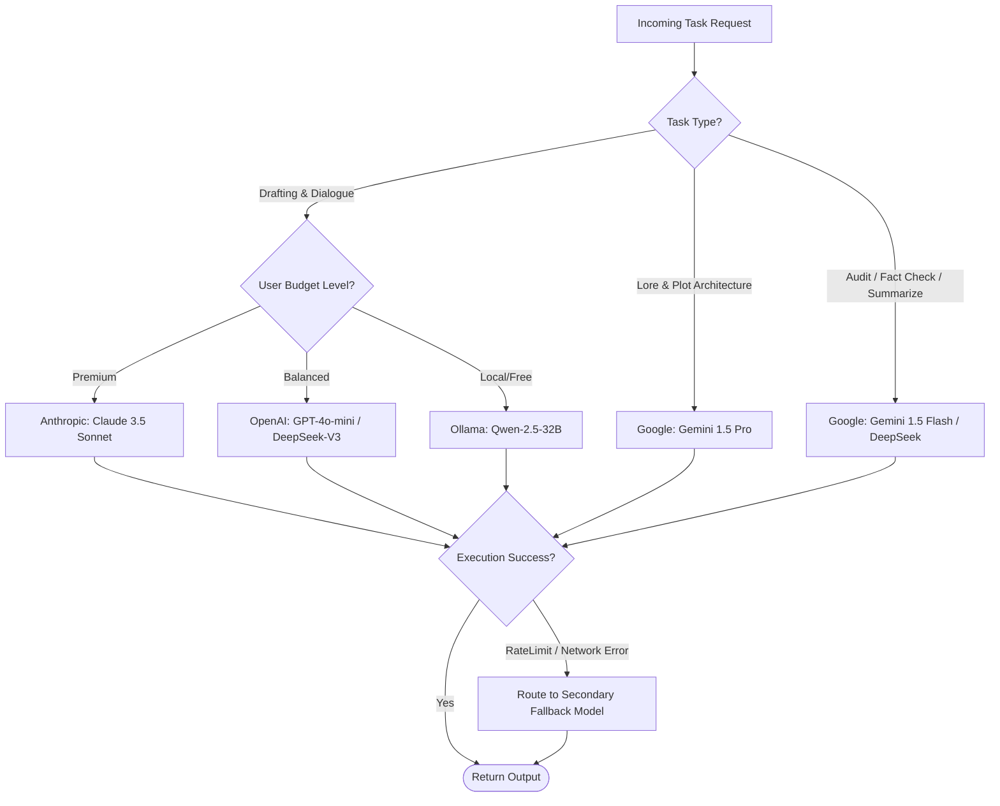

# Hybrid LLM Routing Strategy

## 1. Multi-Tier Model Classification

To achieve the optimal balance between **literary quality**, **inference latency**, and **operational cost**, NovelEngineCore uses a task-based multi-tier model assignment strategy.

```
+------------------------------------------------------------------------------------+
| TASK COMPLEXITY & ROLE       | RECOMMENDED MODEL TIERS       | REASONING          |
+------------------------------+-------------------------------+--------------------+
| 1. High-Emotion Scene Prose  | Tier 1: Claude 3.5 Sonnet     | Rich vocabulary,   |
|    & Crucial Climax Dialogue |         GPT-4o                | natural phrasing,  |
|                              |                               | strong empathy.    |
+------------------------------+-------------------------------+--------------------+
| 2. World-Building &          | Tier 2: Gemini 1.5 Pro        | Massive context,   |
|    Macro Plot Arc Planning   |         DeepSeek-V3           | strong structured  |
|                              |                               | reasoning, cheap.  |
+------------------------------+-------------------------------+--------------------+
| 3. Continuity Audit, Schema  | Tier 3: Gemini 1.5 Flash      | High speed, near-  |
|    Validation & Summaries    |         DeepSeek-V3           | zero cost for      |
|                              |         Llama-3.3-70B         | analytical checks. |
+------------------------------+-------------------------------+--------------------+
| 4. Offline / Private Mode    | Tier 4: Qwen-2.5-32B / 72B    | Uncensored, runs   |
|                              |         Llama-3.1-8B (Micro)  | on local GPU rigs. |
+------------------------------------------------------------------------------------+
```

---

## 2. Dynamic Routing Matrix

The `SmartRouter` evaluates every request using a scoring algorithm based on task type, user budget, and active API availability:



---

## 3. Cost-Quality Comparison

| Execution Scenario | Pure Flagship (GPT-4o / Claude only) | NovelEngineCore Hybrid Routing | Cost Reduction |
| :--- | :--- | :--- | :--- |
| **50-Chapter Novel (~150,000 words)** | ~$25.00 – $40.00 USD | ~$1.80 – $4.50 USD | **~85% Savings** |
| **Full Local Mode (Ollama)** | $0.00 (Requires 24GB VRAM GPU) | $0.00 (Runs on 16GB VRAM with micro-beats) | **100% Free** |

---

## 4. Fallback & Resilience Rules

1. **Exponential Backoff:** If a provider returns HTTP 429 (Rate Limit), retry with jitter up to 3 times before switching providers.
2. **Provider Failover Chains:**
   - Primary: `Claude-3.5-Sonnet` $\rightarrow$ Secondary: `GPT-4o` $\rightarrow$ Tertiary: `DeepSeek-V3`.
3. **Graceful Token Truncation:** If a model returns Context Length Exceeded, the `ContextBudgeter` automatically condenses previous scene summaries without sacrificing core world rules.
