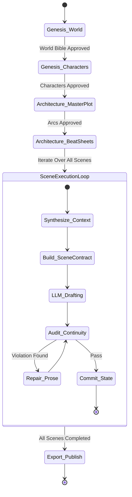

# State Machine & Narrative Pipeline

## 1. Overview

Writing a full-length novel requires deterministic state tracking. The **Story State Machine** governs the multi-stage pipeline, persisting state at every step to allow full rollbacks, chapter branches, and deterministic resumes.



---

## 2. Pipeline Stages

### Stage 1: Genesis (World & Characters)
- **Inputs:** Logline, Genre, Sub-genre, Core Theme, Style reference.
- **Actions:**
  1. Produce `WorldBible.json` (Cosmology, power scales, rules of magic/technology, geography, factions).
  2. Produce `CharacterMatrix.json` (Profiles, psychological flaws, secrets, speaking quirks, starting inventory).
- **Validation:** Must pass completeness check (no empty attributes or undefined factions).

### Stage 2: Narrative Architecture (Plot & Beat Sheets)
- **Inputs:** World Bible, Character Matrix, Target length (chapters/words).
- **Structure Models:**
  - Classic 3-Act Structure (Setup, Confrontation, Resolution).
  - Dan Harmon's Story Circle (You -> Need -> Go -> Search -> Find -> Take -> Return -> Change).
  - Webnovel Pacing (Mini-arcs every 3-5 chapters with recurring payoffs and cliffhangers).
- **Outputs:** `StoryArc.json` containing hierarchical nodes:
  `Novel` $\rightarrow$ `Volumes` $\rightarrow$ `Chapters` $\rightarrow$ `Scenes (Beats)`.

### Stage 3: The Scene Execution Loop
For each `SceneBeat` in the sequence:
1. **Dynamic Context Synthesis:** Extracts only facts and characters present in the current scene.
2. **Contract Generation:** Compiles constraints, targets, and forbidden actions into `SceneContract.json`.
3. **Drafting:** Dispatches payload to the selected LLM.
4. **Continuity Audit:** Evaluates draft against world rules and previous chapter state.
5. **State Mutation:** Updates character inventories, health, relationship metrics, and marks open plot hooks.

---

## 3. Snapshot & Checkpoint Persistence

All state transitions are persisted using immutable append-only events:

```
storage/
├── story_state.sqlite          # Primary ACID store for state entities
└── checkpoints/
    ├── ch01_sc01_state.json    # Snapshot before Scene 1
    ├── ch01_sc02_state.json    # Snapshot before Scene 2
    └── ...
```

### Snapshot Rollback & Branching
If a user or AI decides to alter a decision in Chapter 3:
1. The engine restores the state snapshot at `ch03_sc01_state.json`.
2. A new branch ID is assigned (e.g., `branch_alt_ch03`).
3. Subsequent scenes are regenerated based on the updated branch state without corrupting the main timeline.
