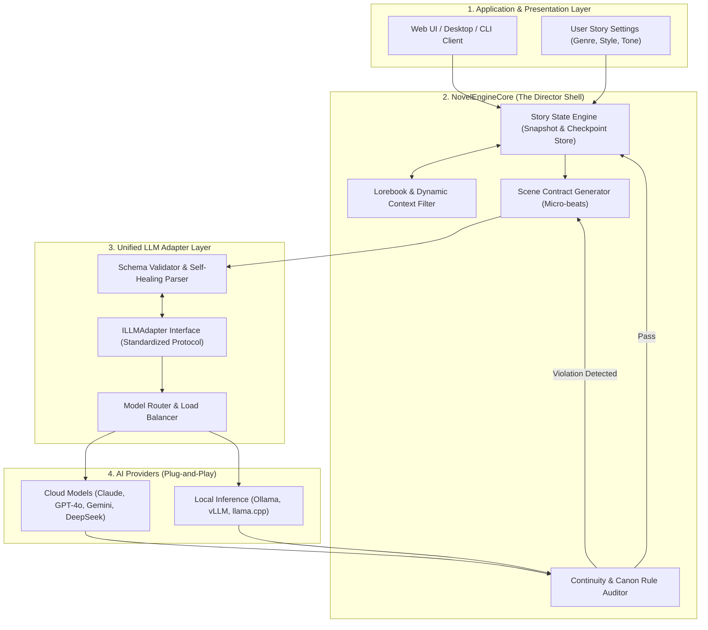

# System Architecture Overview

## 1. High-Level Concept

**NovelEngineCore** is designed around the principle of **Deterministic Narrative Orchestration**. Instead of prompting an LLM with vague instructions, the architecture models the creative writing process as a verifiable state machine governed by explicit data schemas.

---

## 2. Layer Separation of Concerns

### Layer 1: Application & Presentation
- Collects initial user seed (logline, genre, target chapter count, POV, writing style).
- Provides real-time streaming feedback and allows interactive interventions (co-pilot adjustments to beats, character edits, or manual overrides).

### Layer 2: NovelEngineCore (The Director Shell)
- **State Engine:** Holds the single source of truth for the entire novel (World facts, character progression, inventory items, relationship matrix, plot arcs).
- **Dynamic Context Filter:** Selects ONLY the relevant slice of lore and character data needed for the current scene, avoiding context bloating.
- **Scene Contract Generator:** Compiles a deterministic specification detailing exactly what must occur, who is present, and what is forbidden.
- **Continuity & Rule Auditor:** Validates drafted prose against canon laws and previous events before committing changes to the state.

### Layer 3: Unified LLM Adapter Layer
- **Standardized Adapter (`ILLMAdapter`):** Converts engine requests into provider-specific payloads (OpenAI, Anthropic, Google, Ollama).
- **Self-Healing Guardrails:** Ensures structured responses match Pydantic/Zod schemas; repairs malformed JSON or markdown fences automatically.
- **Model Router:** Routes tasks to the most cost-effective and capable model for that specific phase.

### Layer 4: Model Providers
- Pluggable backends: Cloud APIs (Anthropic Claude 3.5 Sonnet, OpenAI GPT-4o, Google Gemini 1.5, DeepSeek-V3) or local execution (Llama 3.3, Qwen 2.5, Mistral).

---

## 3. Data Flow Lifecycle

1. **Genesis Phase:** User provides high-level concept $\rightarrow$ Shell generates `WorldBible` and `CharacterDossiers`.
2. **Plot Structuring:** Shell generates Master Plot Arcs and decomposes chapters into `SceneBeats`.
3. **Execution Loop (Per Scene):**
   - Step A: Filter lore and retrieve active character states.
   - Step B: Issue a `SceneContract` to the LLM Adapter.
   - Step C: LLM streams draft prose.
   - Step D: Auditor inspects prose for canon violations and state mutations (injuries, items acquired/lost).
   - Step E: State snapshot is committed to local persistent storage (SQLite/JSON).
