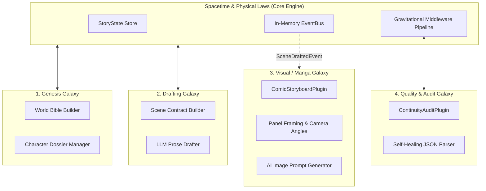

# Universe Architecture v4.0 Mapping for NovelEngineCore

## 1. Architectural Philosophy

Aligned with **Universe Plugin Architecture v4.0** (`E:\16. AgentOption\architecture\universe-plugin.md`), NovelEngineCore structures the storytelling platform as an extensible multi-galaxy ecosystem where features expand indefinitely without mutating core invariant laws.

```
+------------------------------------------------------------------------------------+
| 🌌 PHYSICAL LAWS (Core Contracts)   -> BaseLLMAdapter, INovelPlugin, StoryState     |
| 🪐 SPACETIME (Infrastructure)        -> In-Memory EventBus, Middleware Pipeline, DI |
| 🌠 GALAXIES (Feature Domains)        -> Genesis, Drafting, Comic/Visual, Audio, Pub |
| ⭐ STARS (Self-contained Plugins)    -> ComicStoryboardPlugin, ContinuityAuditPlugin|
| 🕳️ BLACK HOLES (God Classes)        -> STRICTLY FORBIDDEN ANTI-PATTERN             |
+------------------------------------------------------------------------------------+
```

---

## 2. The 8 Core Principles in NovelEngineCore

| Principle | Application in NovelEngineCore |
| :--- | :--- |
| **1. Core Stable, Modules Volatile** | `NovelEngineCore` contracts (`StoryState`, `SceneContract`) remain invariant. New genres (Xianxia, Cyberpunk), visual renderers (Webtoon, 4-Koma), and TTS engines plug in as autonomous modules. |
| **2. Module Independence** | `Plugin -> Core/EventBus` (Allowed) \| `Plugin A -> Plugin B` (FORBIDDEN). Comic Storyboard plugin does not directly call the Text Drafter; it subscribes to `SceneDraftedEvent` via the EventBus. |
| **3. Contract-First** | All plugins implement `INovelPlugin` with explicit lifecycle hooks (`on_story_init`, `pre_scene_draft`, `post_scene_draft`). |
| **4. Self-Registration** | Plugins auto-register via `PluginRegistry` or decorators without modifying engine core files. |
| **5. Indirect Communication** | Asynchronous In-Memory `EventBus` for cross-galaxy event broadcasting (`StoryInitializedEvent`, `SceneDraftedEvent`, `CanonViolationEvent`). |
| **6. Data Sovereignty** | Plugins never mutate `StoryState` directly; all state transitions flow through audited mutation events in the Core Engine. |
| **7. Middleware as Gravitational Pipeline** | Pre-generation filters (Context Budgeter, OOC Guard) and Post-generation filters (Self-Healing JSON, Continuity Auditor) run in an ordered pipeline. |
| **8. Progressive Migration** | Runs seamlessly in-memory (Level 1) $\rightarrow$ Fast REST/WebSocket Microservice (Level 2) $\rightarrow$ Distributed worker queue with Redis/RabbitMQ (Level 3). |

---

## 3. Galaxy Domain Mapping



---

## 4. Package Layering Strategy

```text
┌─────────────────────────────────────────────────────────────┐
│          novel_engine.plugins (Stars / Feature Modules)     │
│  - comic_storyboard_plugin.py (Manga & Webtoon Scripts)     │
│  - continuity_audit_plugin.py (Canon Law Enforcement)       │
│  - audiobook_tts_plugin.py    (Audio Novel Synthesizer)     │
├─────────────────────────────────────────────────────────────┤
│          novel_engine.core (Spacetime & Physical Laws)      │
│  - EventBus · MiddlewarePipeline · PluginRegistry           │
│  - StoryState · SceneContract · BaseLLMAdapter              │
└─────────────────────────────────────────────────────────────┘
```
